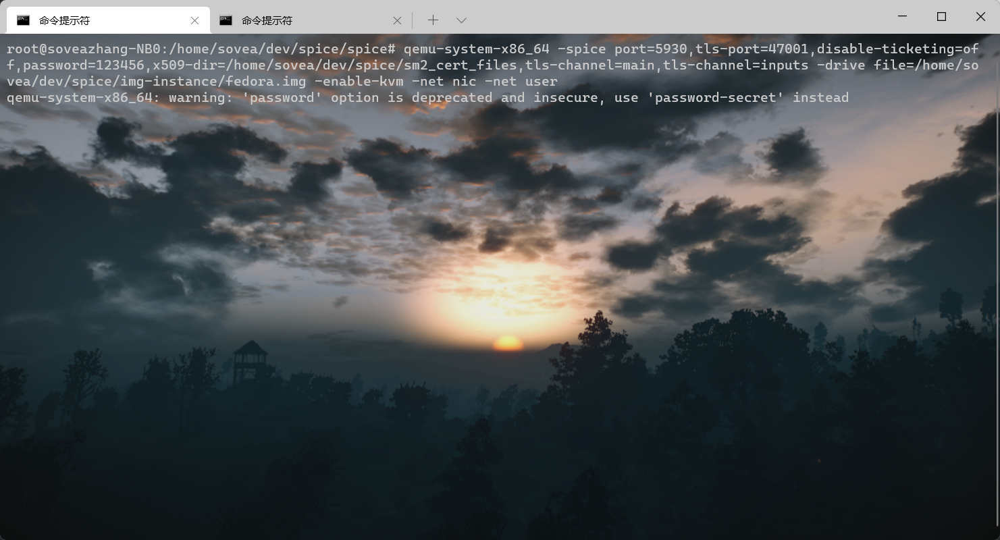
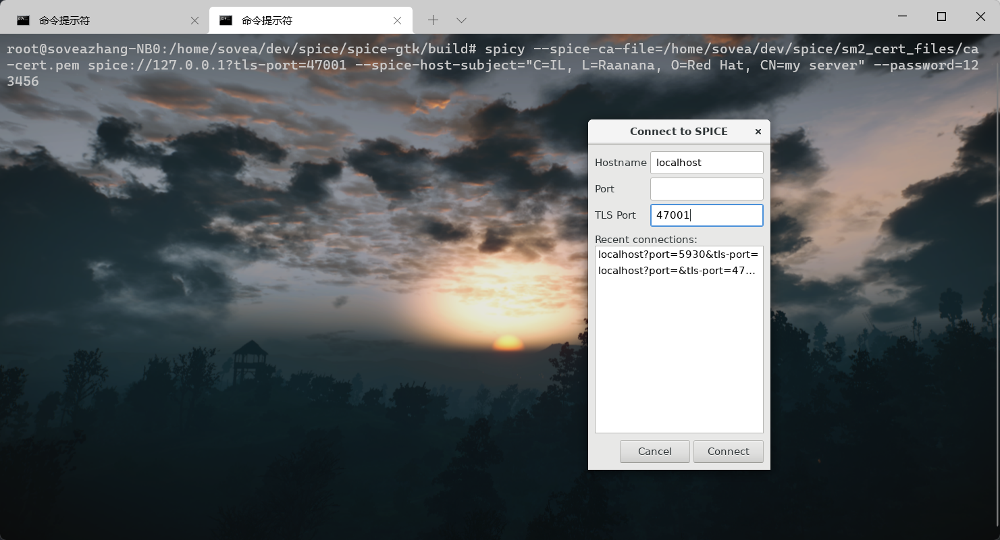
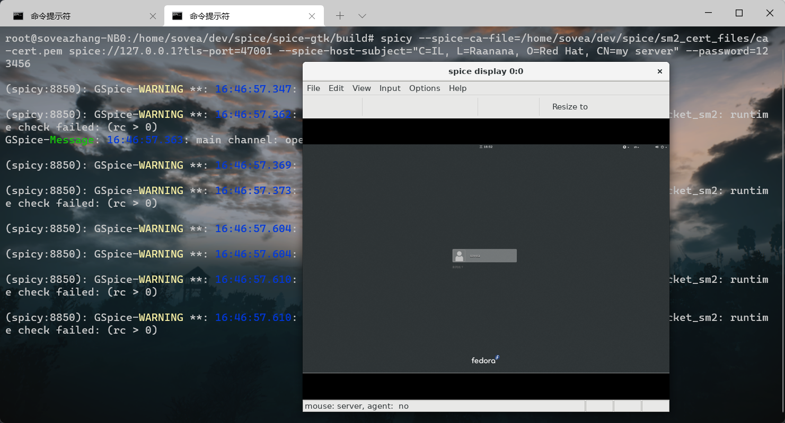
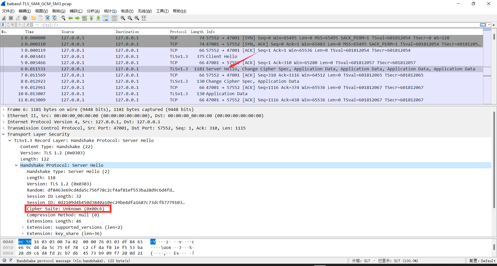

### Spicy TLS连接测试

##### RSA证书

```sh
qemu-system-x86_64 -spice port=5930,tls-port=47001,disable-ticketing=on,x509-dir=/home/sovea/dev/spice/rsa_cert_files,tls-channel=main,tls-channel=inputs,streaming-video=filter,playback-compression=off,seamless-migration=on -drive file=/home/sovea/dev/spice/img-instance/fedora.img -m 1024 -smp cores=2,threads=2,sockets=1 -device qxl-vga,vgamem_mb=128 -enable-kvm -cpu host -device virtio-serial -chardev spicevmc,id=vdagent,debug=0,name=vdagent

spicy --spice-ca-file=/home/sovea/dev/spice/rsa_cert_files/ca-cert.pem spice://127.0.0.1?tls-port=47001 --spice-host-subject="C=IL, L=Raanana, O=Red Hat, CN=my server"
```

##### SM2证书

```sh
qemu-system-x86_64 -spice port=5930,tls-port=47001,,disable-ticketing=off,password=123456,x509-dir=/home/sovea/dev/spice/sm2_cert_files,tls-channel=main,tls-channel=inputs,streaming-video=filter,playback-compression=off,seamless-migration=on -drive file=/home/sovea/dev/spice/img-instance/fedora.img -m 1024 -smp cores=2,threads=2,sockets=1 -device qxl-vga,vgamem_mb=128 -enable-kvm -cpu host -device virtio-serial -chardev spicevmc,id=vdagent,debug=0,name=vdagent

spicy --spice-ca-file=/home/sovea/dev/spice/sm2_cert_files/ca-cert.pem spice://127.0.0.1?tls-port=47001 --spice-host-subject="C=IL, L=Raanana, O=Red Hat, CN=my server" --password=123456
```
##### 连接示例






##### 抓取流量

```sh
tcpdump  -i 网卡 -nn -vv  port 47001  -w  babassl.pcap
```

##### wireshark验证加密套件

> RFC 8998: ShangMi (SM) Cipher Suites for TLS 1.3

```shell
   CipherSuite TLS_SM4_GCM_SM3 = { 0x00, 0xC6 };
   CipherSuite TLS_SM4_CCM_SM3 = { 0x00, 0xC7 };
```


