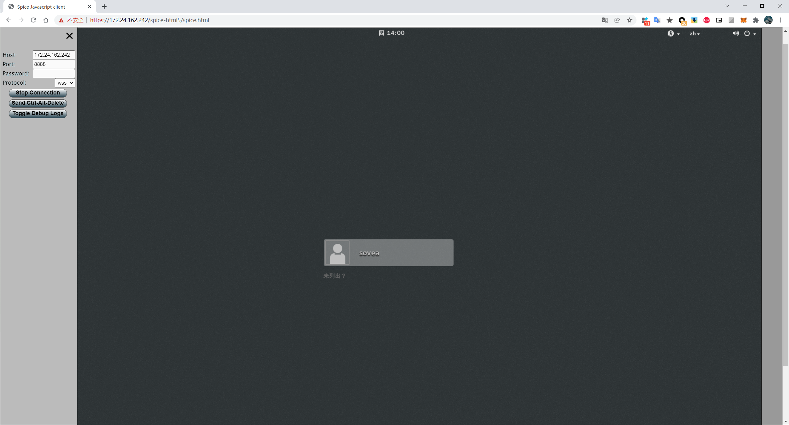
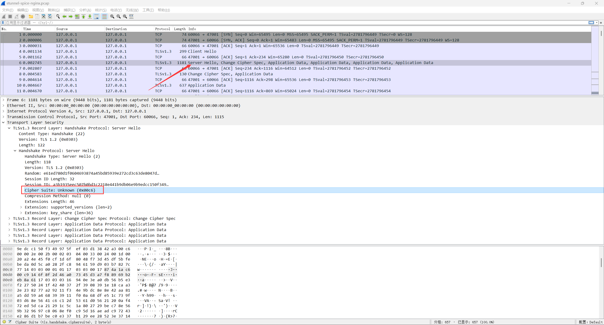

### Stunel 反向代理、加密转发本地

> 该环节的设计目的是为解决 Spice-html5 Web Client 本地端口转发过程数据加密问题
> 这里我们可以使用国密环境编译Stunnel，使其支持相关密码套件和国密证书，利用其进行加密代理转发

##### 国密环境编译Stunnel
```shell
wget https://www.stunnel.org/downloads/stunnel-5.62.tar.gz
tar -xzf stunnel-5.62.tar.gz && cd stunnel-5.62/

./configure --prefix=/usr/local/stunnel --with-ssl=/usr/local/babassl
make; sudo make install
```

```shell
cp /usr/local/stunnel/etc/stunnel/stunnel.conf-sample /usr/local/stunnel/conf/spice-tls.conf
```
写入配置

> 国密

```
[http]
sslVersion = TLSv1.3
options = CIPHER_SERVER_PREFERENCE
client = yes
accept = 47002 # 监听端口
connect = 127.0.0.1:47001  # 转发目标
verify = 1
ciphersuites = TLS_SM4_GCM_SM3:TLS_SM4_CCM_SM3
cert = /home/sovea/dev/spice/sm2_cert_files/server-cert.pem
key = /home/sovea/dev/spice/sm2_cert_files/server-key.pem
CAfile = /home/sovea/dev/spice/sm2_cert_files/ca-cert.pem
```

> 非国密

```
[http]
client = yes
accept = 47002 # 监听端口
connect = 127.0.0.1:47001 # 转发目标
verify = 1
cert = /home/sovea/dev/spice/rsa_cert_files/server-cert.pem
key = /home/sovea/dev/spice/rsa_cert_files/server-key.pem
CAfile = /home/sovea/dev/spice/rsa_cert_files/ca-cert.pem
```

##### 连接示例



> RFC 8998: ShangMi (SM) Cipher Suites for TLS 1.3

```shell
   CipherSuite TLS_SM4_GCM_SM3 = { 0x00, 0xC6 };
   CipherSuite TLS_SM4_CCM_SM3 = { 0x00, 0xC7 };
```


