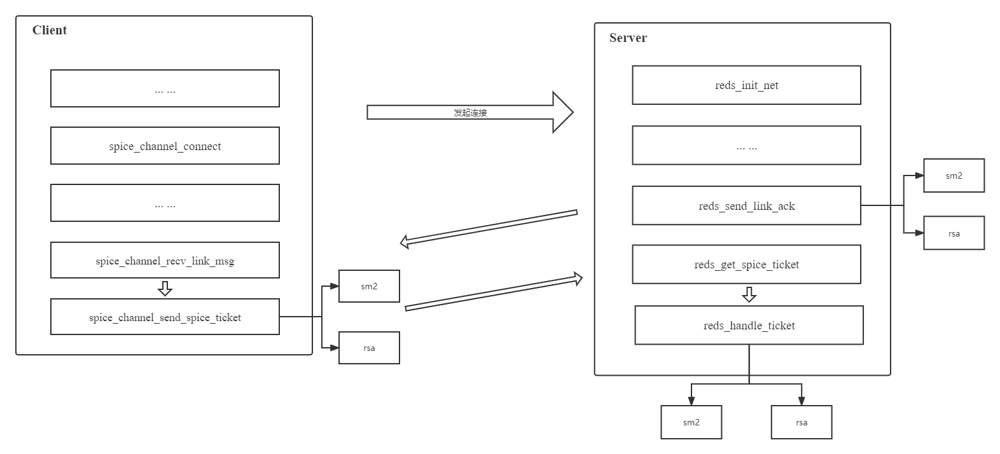
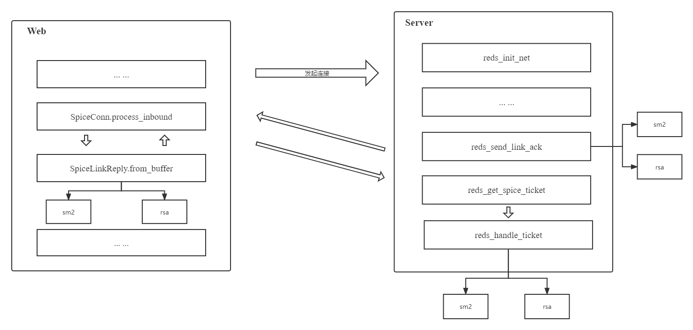

### Spice-Server

https://github.com/spice-gm/qemu/tree/stable-6.1-for-spice-gm
https://github.com/spice-gm/spice-gm

##### *Password* 口令验证 *SM2* 实现 --- Server端

首先使用 `openssl EVP` 接口实现 *SM2* 工具库，*Server* 需要 *CPP* 版本
> *sm2-EVP* 项目见 *<https://github.com/Sovea/sm2-EVP>*

##### 口令验证改造

Spice Server及QEMU改造主要是对口令身份验证逻辑的改造。改造的期望结果是实现基于SM2算法的口令验证，并保持原RSA方案可用，通过QEMU启动虚拟机时指定ticket-handler参数进行自由选择。

QEMU在此改造过程中主要承担参数解析功能，需新增参数ticket-handler并将值通过Spice Server中通过__attribute__((visibility( default )))导出的函数符号进行传递。参数解析工作主要由spice-core.c中qemu_spice_init函数完成，需新增ticket-handler字段并通过qemu_opt_get读取对应值，并在qemu-options.hx配置文件中增加ticket-handler参数介绍。

Spice Server需导出用于设置ticket-handler的函数，且Server端连接口令相关配置主要存在于reds->config->taTicket(TicketAuthentication结构体)。具体实现是在TicketAuthentication中新增ticket-handler变量，将设计函数spice_server_set_ticket_handler在spice-server.h、spice-server.syms中声明并在reds.cpp中实现，用于将ticket-handler值进行保存，并设定默认值为sm2。

将Server端reds_send_link_ack、reds_handle_ticket逻辑拆分为sm2、rsa两种实现，利用sm2-EVP完成基于SM2算法的口令验证逻辑开发，最终形成如图所示逻辑结构，口令验证实际逻辑路线由ticket-handler控制。





##### ticket-handler参数添加

```c
static void qemu_spice_init(void)
{
    QemuOpts *opts = QTAILQ_FIRST(&qemu_spice_opts.head);
    char *password = NULL;
    const char *passwordSecret;
    const char *str, *x509_dir, *addr, *ticket_handler,
        *x509_key_password = NULL,
        *x509_dh_file = NULL,
        *tls_ciphers = NULL;
    char *x509_key_file = NULL,
        *x509_cert_file = NULL,
        *x509_cacert_file = NULL;
    int port, tls_port, addr_flags;
    spice_image_compression_t compression;
    spice_wan_compression_t wan_compr;
    bool seamless_migration;

    qemu_thread_get_self(&me);

    if (!opts) {
        return;
    }
    port = qemu_opt_get_number(opts, "port", 0);
    tls_port = qemu_opt_get_number(opts, "tls-port", 0);
    if (port < 0 || port > 65535) {
        error_report("spice port is out of range");
        exit(1);
    }
    if (tls_port < 0 || tls_port > 65535) {
        error_report("spice tls-port is out of range");
        exit(1);
    }
    passwordSecret = qemu_opt_get(opts, "password-secret");
    if (passwordSecret) {
        Error *local_err = NULL;
        if (qemu_opt_get(opts, "password")) {
            error_report("'password' option is mutually exclusive with "
                         "'password-secret'");
            exit(1);
        }
        password = qcrypto_secret_lookup_as_utf8(passwordSecret,
                                                 &local_err);
        if (!password) {
            error_report_err(local_err);
            exit(1);
        }
    } else {
        str = qemu_opt_get(opts, "password");
        if (str) {
            warn_report("'password' option is deprecated and insecure, "
                        "use 'password-secret' instead");
            password = g_strdup(str);
        }
    }

    ticket_handler = qemu_opt_get(opts, "ticket-handler");
    if (!ticket_handler) {
        ticket_handler = "sm2";
    }

    if (tls_port) {
        x509_dir = qemu_opt_get(opts, "x509-dir");
        if (!x509_dir) {
            x509_dir = ".";
        }

        str = qemu_opt_get(opts, "x509-key-file");
        if (str) {
            x509_key_file = g_strdup(str);
        } else {
            x509_key_file = g_strdup_printf("%s/%s", x509_dir,
                                            X509_SERVER_KEY_FILE);
        }

        str = qemu_opt_get(opts, "x509-cert-file");
        if (str) {
            x509_cert_file = g_strdup(str);
        } else {
            x509_cert_file = g_strdup_printf("%s/%s", x509_dir,
                                             X509_SERVER_CERT_FILE);
        }

        str = qemu_opt_get(opts, "x509-cacert-file");
        if (str) {
            x509_cacert_file = g_strdup(str);
        } else {
            x509_cacert_file = g_strdup_printf("%s/%s", x509_dir,
                                               X509_CA_CERT_FILE);
        }

        x509_key_password = qemu_opt_get(opts, "x509-key-password");
        x509_dh_file = qemu_opt_get(opts, "x509-dh-key-file");
        tls_ciphers = qemu_opt_get(opts, "tls-ciphers");
    }

    addr = qemu_opt_get(opts, "addr");
    addr_flags = 0;
    if (qemu_opt_get_bool(opts, "ipv4", 0)) {
        addr_flags |= SPICE_ADDR_FLAG_IPV4_ONLY;
    } else if (qemu_opt_get_bool(opts, "ipv6", 0)) {
        addr_flags |= SPICE_ADDR_FLAG_IPV6_ONLY;
#ifdef SPICE_ADDR_FLAG_UNIX_ONLY
    } else if (qemu_opt_get_bool(opts, "unix", 0)) {
        addr_flags |= SPICE_ADDR_FLAG_UNIX_ONLY;
#endif
    }

    spice_server = spice_server_new();
    spice_server_set_addr(spice_server, addr ? addr : "", addr_flags);
    if (port) {
        spice_server_set_port(spice_server, port);
    }
    if (tls_port) {
        spice_server_set_tls(spice_server, tls_port,
                             x509_cacert_file,
                             x509_cert_file,
                             x509_key_file,
                             x509_key_password,
                             x509_dh_file,
                             tls_ciphers);
    }
    spice_server_set_ticket_handler(spice_server, ticket_handler);
    if (password) {
        qemu_spice.set_passwd(password, false, false);
    }
    spice_server_set_ticket_handler(spice_server, ticket_handler);
    if (qemu_opt_get_bool(opts, "sasl", 0)) {
        if (spice_server_set_sasl(spice_server, 1) == -1) {
            error_report("spice: failed to enable sasl");
            exit(1);
        }
        auth = "sasl";
    }
    if (qemu_opt_get_bool(opts, "disable-ticketing", 0)) {
        auth = "none";
        spice_server_set_noauth(spice_server);
    }

    if (qemu_opt_get_bool(opts, "disable-copy-paste", 0)) {
        spice_server_set_agent_copypaste(spice_server, false);
    }

    if (qemu_opt_get_bool(opts, "disable-agent-file-xfer", 0)) {
        spice_server_set_agent_file_xfer(spice_server, false);
    }

    compression = SPICE_IMAGE_COMPRESS_AUTO_GLZ;
    str = qemu_opt_get(opts, "image-compression");
    if (str) {
        compression = parse_compression(str);
    }
    spice_server_set_image_compression(spice_server, compression);

    wan_compr = SPICE_WAN_COMPRESSION_AUTO;
    str = qemu_opt_get(opts, "jpeg-wan-compression");
    if (str) {
        wan_compr = parse_wan_compression(str);
    }
    spice_server_set_jpeg_compression(spice_server, wan_compr);

    wan_compr = SPICE_WAN_COMPRESSION_AUTO;
    str = qemu_opt_get(opts, "zlib-glz-wan-compression");
    if (str) {
        wan_compr = parse_wan_compression(str);
    }
    spice_server_set_zlib_glz_compression(spice_server, wan_compr);

    str = qemu_opt_get(opts, "streaming-video");
    if (str) {
        int streaming_video = parse_stream_video(str);
        spice_server_set_streaming_video(spice_server, streaming_video);
    } else {
        spice_server_set_streaming_video(spice_server, SPICE_STREAM_VIDEO_OFF);
    }

    spice_server_set_agent_mouse
        (spice_server, qemu_opt_get_bool(opts, "agent-mouse", 1));
    spice_server_set_playback_compression
        (spice_server, qemu_opt_get_bool(opts, "playback-compression", 1));

    qemu_opt_foreach(opts, add_channel, &tls_port, &error_fatal);

    spice_server_set_name(spice_server, qemu_name ?: "QEMU " QEMU_VERSION);
    spice_server_set_uuid(spice_server, (unsigned char *)&qemu_uuid);

    seamless_migration = qemu_opt_get_bool(opts, "seamless-migration", 0);
    spice_server_set_seamless_migration(spice_server, seamless_migration);
    spice_server_set_sasl_appname(spice_server, "qemu");
    if (spice_server_init(spice_server, &core_interface) != 0) {
        error_report("failed to initialize spice server");
        exit(1);
    };
    using_spice = 1;

    migration_state.notify = migration_state_notifier;
    add_migration_state_change_notifier(&migration_state);
    spice_migrate.base.sif = &migrate_interface.base;
    qemu_spice.add_interface(&spice_migrate.base);

    qemu_spice_input_init();

    qemu_spice_display_stop();

    g_free(x509_key_file);
    g_free(x509_cert_file);
    g_free(x509_cacert_file);
    g_free(password);

#ifdef HAVE_SPICE_GL
    if (qemu_opt_get_bool(opts, "gl", 0)) {
        if ((port != 0) || (tls_port != 0)) {
            error_report("SPICE GL support is local-only for now and "
                         "incompatible with -spice port/tls-port");
            exit(1);
        }
        if (egl_rendernode_init(qemu_opt_get(opts, "rendernode"),
                                DISPLAYGL_MODE_ON) != 0) {
            error_report("Failed to initialize EGL render node for SPICE GL");
            exit(1);
        }
        display_opengl = 1;
        spice_opengl = 1;
    }
#endif
}
```


##### *Ticket* 口令验证核心函数

```cpp
static bool reds_send_link_ack_sm2(RedsState *reds, RedLinkInfo *link)
{
    struct {
        SpiceLinkHeader header;
        SpiceLinkReply ack;
    } msg;
    RedChannel *channel;
    const RedChannelCapabilities *channel_caps;
    BUF_MEM *bmBuf;
    BIO *bio = nullptr;
    int ret = FALSE;
    size_t hdr_size;
    spice_warning("Send Link Ack With SM2.");
    SPICE_VERIFY(sizeof(msg) == sizeof(SpiceLinkHeader) + sizeof(SpiceLinkReply));

    msg.header.magic = SPICE_MAGIC;
    hdr_size = sizeof(msg.ack);
    msg.header.major_version = GUINT32_TO_LE(SPICE_VERSION_MAJOR);
    msg.header.minor_version = GUINT32_TO_LE(SPICE_VERSION_MINOR);

    msg.ack.error = GUINT32_TO_LE(SPICE_LINK_ERR_OK);

    channel = reds_find_channel(reds, link->link_mess->channel_type,
                                link->link_mess->channel_id);
    if (!channel) {
        if (link->link_mess->channel_type != SPICE_CHANNEL_MAIN) {
            spice_warning("Received wrong header: channel_type != SPICE_CHANNEL_MAIN");
            return FALSE;
        }
        spice_assert(reds->main_channel);
        channel = reds->main_channel.get();
    }

    reds_channel_init_auth_caps(link, channel); /* make sure common caps are set */

    channel_caps = channel->get_local_capabilities();
    msg.ack.num_common_caps = GUINT32_TO_LE(channel_caps->num_common_caps);
    msg.ack.num_channel_caps = GUINT32_TO_LE(channel_caps->num_caps);
    hdr_size += channel_caps->num_common_caps * sizeof(uint32_t);
    hdr_size += channel_caps->num_caps * sizeof(uint32_t);
    msg.header.size = GUINT32_TO_LE(hdr_size);
    msg.ack.caps_offset = GUINT32_TO_LE(sizeof(SpiceLinkReply));
    if (!reds->config->sasl_enabled
        || !red_link_info_test_capability(link, SPICE_COMMON_CAP_AUTH_SASL)) {

        if (!(bio = BIO_new(BIO_s_mem()))) {
            spice_warning("BIO new failed");
            red_dump_openssl_errors();
            return FALSE;
        }
        // SM2 handle
        // generate EC key pair(pem)
        sm2Handler.GenEcPairKey(link->tiTicketing.priKey, link->tiTicketing.pubKey);
        unsigned char *pubKeyArray = (unsigned char *)link->tiTicketing.pubKey.c_str();
        // Get EVP_PKEY
        sm2Handler.CreateEVP_PKEY(pubKeyArray, 1, &link->tiTicketing.evp_pkey);
        link->tiTicketing.ec_key = EVP_PKEY_get1_EC_KEY(link->tiTicketing.evp_pkey);
        i2d_EC_PUBKEY_bio(bio, link->tiTicketing.ec_key);
        BIO_get_mem_ptr(bio, &bmBuf);

        memcpy(msg.ack.pub_key, bmBuf->data, sizeof(msg.ack.pub_key));
    } else {
        /* if the client sets the AUTH_SASL cap, it indicates that it
         * supports SASL, and will use it if the server supports SASL as
         * well.
         */
        spice_warning("not initialising SM2 key");
        memset(msg.ack.pub_key, '\0', sizeof(msg.ack.pub_key));
    }

    if (!red_stream_write_all(link->stream, &msg, sizeof(msg)))
        goto end;
    for (unsigned int i = 0; i < channel_caps->num_common_caps; i++) {
        guint32 cap = GUINT32_TO_LE(channel_caps->common_caps[i]);
        if (!red_stream_write_all(link->stream, &cap, sizeof(cap)))
            goto end;
    }
    for (unsigned int i = 0; i < channel_caps->num_caps; i++) {
        guint32 cap = GUINT32_TO_LE(channel_caps->caps[i]);
        if (!red_stream_write_all(link->stream, &cap, sizeof(cap)))
            goto end;
    }

    ret = TRUE;

end:
    if (bio != nullptr) BIO_free(bio);
    return ret;
}

static void reds_handle_ticket_sm2(void *opaque) {
    auto link = static_cast<RedLinkInfo *>(opaque);
    RedsState *reds = link->reds;
    int password_size;

    string encrypted_data_str((char *)link->tiTicketing.encrypted_ticket.encrypted_data, 128);
    string decrypted_password;
    int len_plaint = 0;
    spice_warning("Handle Ticket With SM2.");
    password_size = sm2Handler.Decrypt(encrypted_data_str, encrypted_data_str.length(), decrypted_password, len_plaint, link->tiTicketing.priKey);
    if (password_size == -1) {
        if (!reds->config->ticketing_enabled || link->skip_auth) {
            reds_handle_link(link);
            return;
        }
        spice_warning("failed to decrypt SM2 encrypted password");
        red_dump_openssl_errors();
        goto error;
    }
    if (reds->config->ticketing_enabled && !link->skip_auth) {
        time_t ltime;
        bool expired;

        if (strlen(reds->config->taTicket.password) == 0) {
            spice_warning("Ticketing is enabled, but no password is set. "
                          "please set a ticket first");
            goto error;
        }

        ltime = spice_get_monotonic_time_ns() / NSEC_PER_SEC;
        expired = (reds->config->taTicket.expiration_time < ltime);

        if (expired) {
            spice_warning("Ticket has expired");
            // goto error;
        }

        if (strcmp(decrypted_password.c_str(), reds->config->taTicket.password) != 0) {
            spice_warning("Invalid password");
            goto error;
        }
    }

    reds_handle_link(link);
    return;

error:
    reds_send_link_result(link, SPICE_LINK_ERR_PERMISSION_DENIED);
    reds_link_free(link);
}

static void reds_get_spice_ticket_sm2(RedLinkInfo *link) {
    red_stream_async_read(
        link->stream,
        reinterpret_cast<uint8_t *>(&link->tiTicketing.encrypted_ticket.encrypted_data),
        128, reds_handle_ticket_sm2, link);
}
```

##### Server改造后增加SM2工具类，编译

> meson.build 修改

```makefile
spice_server_headers = [
  spice_version_h,
  'spice-audio.h',
  'spice-char.h',
  'spice-core.h',
  'spice-input.h',
  'spice-migration.h',
  'spice-qxl.h',
  'spice-server.h',
  'spice-replay.h',
  'spice.h',
  'sm2.h', # Add
]

spice_server_sources = [
  spice_server_headers,
  spice_server_enums,
  'agent-msg-filter.c',
  'agent-msg-filter.h',
  'cache-item.h',
  'char-device.cpp',
  'char-device.h',
   ... ...
  'sm2.h', # Add
  'sm2.cpp', # Add
]
```

