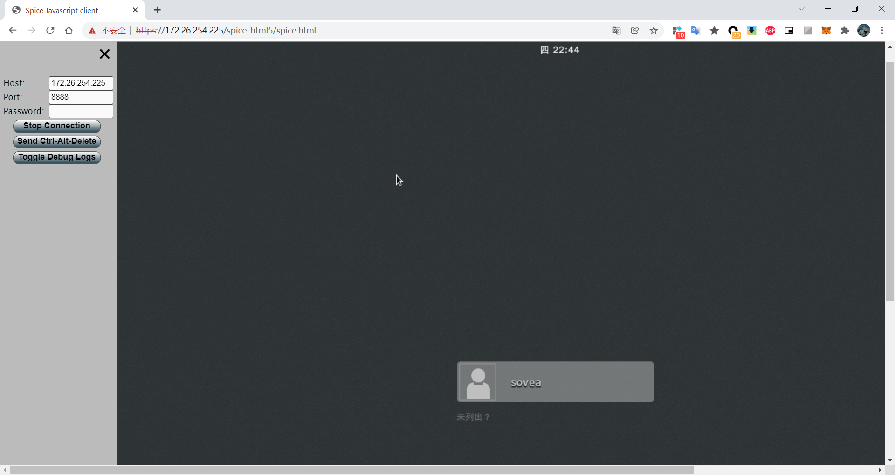
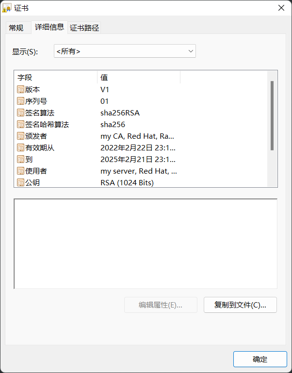
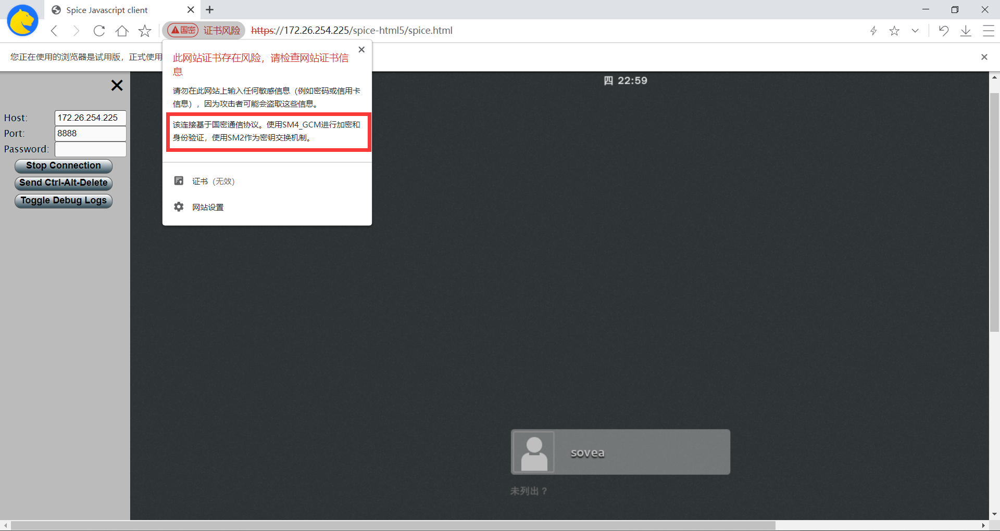

### 连接测试

```sh
# spice no tls
qemu-system-x86_64 -spice port=5930,disable-ticketing=on -drive file=/home/user/dev/spice/img-instance/fedora.img -enable-kvm -m 2048

# spice with tls
qemu-system-x86_64 -spice port=5930,tls-port=47001,disable-ticketing=on,x509-dir=/home/user/dev/spice/sm2_cert_files,tls-channel=main,tls-channel=inputs -drive file=/home/user/dev/spice/img-instance/fedora.img -enable-kvm -m 2048
```

### 连接示例

`Chrome`




`可信浏览器`


