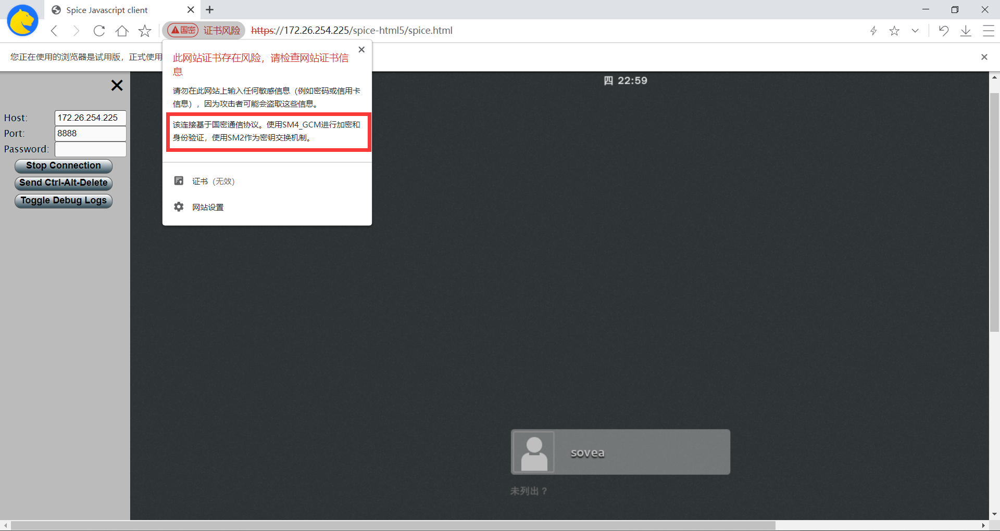

### 连接测试

```sh
# spice no tls
qemu-system-x86_64 -spice port=5930,disable-ticketing=on,streaming-video=filter,playback-compression=off,seamless-migration=on -drive file=/home/sovea/dev/spice/img-instance/fedora.img -m 1024 -smp cores=2,threads=2,sockets=1 -device qxl-vga,vgamem_mb=128 -enable-kvm -cpu host -device virtio-serial -chardev spicevmc,id=vdagent,debug=0,name=vdagent

# spice with tls
qemu-system-x86_64 -spice port=5930,tls-port=47001,disable-ticketing=on,x509-dir=/home/sovea/dev/spice/sm2_cert_files,tls-channel=main,tls-channel=inputs,streaming-video=filter,playback-compression=off,seamless-migration=on -drive file=/home/sovea/dev/spice/img-instance/fedora.img -m 1024 -smp cores=2,threads=2,sockets=1 -device qxl-vga,vgamem_mb=128 -enable-kvm -cpu host -device virtio-serial -chardev spicevmc,id=vdagent,debug=0,name=vdagent
```

### 连接示例

`Chrome`


`可信浏览器`


